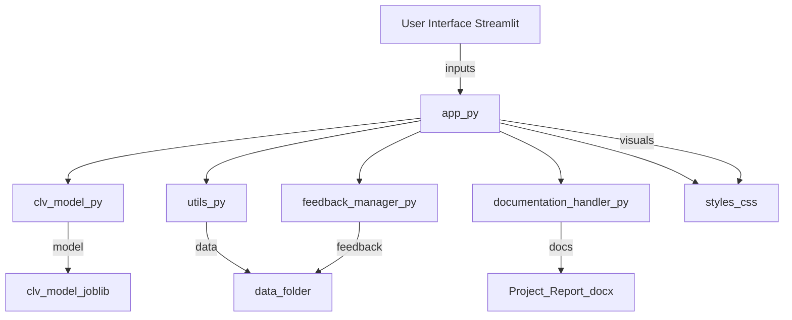

# Customer Lifetime Value (CLV) Prediction Platform

A robust, modular Streamlit application for predicting customer lifetime value (CLV) using advanced machine learning, with a focus on extensibility, maintainability, and business usability.

---

## 📚 Table of Contents

- [Project Overview](#project-overview)
- [Architecture Diagram](#architecture-diagram)
- [File & Directory Structure](#file--directory-structure)
- [Module-by-Module Explanation](#module-by-module-explanation)
- [Data Flow: From Input to Prediction](#data-flow-from-input-to-prediction)
- [Admin, Feedback, and Documentation](#admin-feedback-and-documentation)
- [How to Use](#how-to-use)
- [Testing & Troubleshooting](#testing--troubleshooting)
- [Extending the Platform](#extending-the-platform)
- [License](#license)

---

## Project Overview

This platform enables businesses to:
- Upload or enter customer data
- Predict CLV using ensemble ML models
- Visualize, filter, and export results
- Collect feedback and feature requests
- Access documentation and admin analytics

---

## Architecture Diagram




---

## File & Directory Structure

```
├── app.py                   # Main Streamlit app, orchestrates all modules
├── clv_model.py             # CLV model logic, training, prediction, feature engineering
├── utils.py                 # Utility functions: data validation, sample data, export, etc.
├── feedback_manager.py      # Feedback and feature request system
├── documentation_handler.py # Documentation display and fallback
├── styles.css               # Custom CSS for Streamlit UI
├── clv_model.joblib         # Saved ML model (auto-generated)
├── Requirements.txt         # Python dependencies
├── README.md                # This file
├── test_model.py            # Model pipeline test script
├── test_prediction.py       # Prediction pipeline test script
├── test_column_fix.py       # Column name consistency test
├── test_documentation.py    # Documentation handler test
├── test_layout_fix.py       # Layout/CSS test
├── new.ipynb                # Jupyter notebook for prototyping
├── Project_Report.docx      # Project documentation (auto-generated if missing)
├── OnlineRetail.xlsx        # Example dataset
├── __init__.py              # Python package marker
├── data/
│   ├── feature_requests.json # Feature requests storage
│   └── feedback.json         # Feedback storage (auto-generated)
└── __pycache__/             # Python bytecode cache
```

---

## Module-by-Module Explanation

### `app.py` (Main Application)
- **Role:** Orchestrates the UI, data flow, and module integration.
- **Key Functions:**
  - Loads and saves models (`clv_model.py`)
  - Handles user data input (CSV, manual, sample)
  - Triggers predictions and visualizations
  - Integrates feedback, documentation, and admin features
  - Loads custom CSS (`styles.css`)
- **Integration:** Imports all other modules and coordinates their use.

### `clv_model.py` (CLV Model Logic)
- **Role:** Contains the `EnhancedCLVPredictor` class for all ML logic.
- **Key Features:**
  - Data cleaning and feature engineering
  - Handles both customer-level and transaction-level data
  - Model training, evaluation, and persistence
  - CLV prediction and customer segmentation
  - Feature importance and business insights
- **Integration:** Used by `app.py` for all model operations.

### `utils.py` (Utility Functions)
- **Role:** Provides helper functions for data validation, sample data generation, export, and analytics.
- **Key Functions:**
  - `generate_sample_data()`: Creates realistic sample datasets
  - `validate_customer_data()`: Ensures input data is valid
  - `export_data_to_csv()`: Handles data export
  - Analytics and logging for admin dashboard

### `feedback_manager.py` (Feedback System)
- **Role:** Manages user feedback and feature requests.
- **Key Features:**
  - Feedback form and storage (`data/feedback.json`)
  - Feature request form and storage (`data/feature_requests.json`)
  - Admin dashboard for viewing, filtering, and exporting feedback

### `documentation_handler.py` (Documentation)
- **Role:** Displays project documentation in the app.
- **Key Features:**
  - Reads and displays `Project_Report.docx`
  - Auto-generates a sample docx if missing or empty
  - Provides fallback documentation in markdown

### `styles.css` (Custom Styling)
- **Role:** Provides all custom UI styling for the Streamlit app.
- **Key Features:**
  - Responsive layout, metric cards, tables, and charts
  - Prevents horizontal overflow and ensures mobile compatibility
  - Customizes buttons, forms, and admin panels

### `clv_model.joblib` (Saved Model)
- **Role:** Stores the trained ML model for fast loading and prediction.
- **Integration:** Auto-generated and loaded by `clv_model.py` and `app.py`.

### `Requirements.txt`
- **Role:** Lists all Python dependencies for the project.

### `test_*.py` (Testing Scripts)
- **Role:** Provide unit and integration tests for model, prediction, column consistency, documentation, and layout.

### `new.ipynb`
- **Role:** Jupyter notebook for prototyping and exploratory analysis.

### `Project_Report.docx`
- **Role:** Main project documentation, displayed in-app. Auto-generated if missing.

### `OnlineRetail.xlsx`
- **Role:** Example dataset for model training and testing.

### `data/`
- **feature_requests.json:** Stores user-submitted feature requests.
- **feedback.json:** Stores user feedback (auto-generated).

---

## Data Flow: From Input to Prediction

1. **User Input:**  
   - Upload CSV, generate sample data, or enter manually (handled in `app.py`).
2. **Data Validation:**  
   - Checked and cleaned via `utils.py` and `clv_model.py`.
3. **Feature Engineering:**  
   - `clv_model.py` creates features for ML models.
4. **Model Prediction:**  
   - `clv_model.py` loads or trains model, predicts CLV, segments customers.
5. **Visualization:**  
   - Results shown in tables, charts, and metrics (via `app.py` and `styles.css`).
6. **Export:**  
   - Users can export results as CSV/Excel.
7. **Feedback/Requests:**  
   - Users submit feedback/requests, stored in `data/` and managed by `feedback_manager.py`.
8. **Documentation:**  
   - Users can view/download documentation via `documentation_handler.py`.

---

## Admin, Feedback, and Documentation

- **Admin Access:**  
  - Enable via sidebar, password: `clv_admin_2024` (change in `app.py`).
  - View feedback, feature requests, and analytics.

- **Feedback System:**  
  - Users submit feedback and feature requests.
  - Admins can view, filter, and export all feedback.

- **Documentation:**  
  - In-app documentation from `Project_Report.docx`.
  - Auto-generates fallback documentation if file is missing.

---

## How to Use

### Installation

```bash
pip install -r Requirements.txt
```

### Running the App

```bash
streamlit run app.py
```

- Open [http://localhost:8501](http://localhost:8501) in your browser.

  
 
-You will see this interface as the app starts.

- Now you are presented with a choice of either uploading your customer data, Or generating sample data or manually entering the data as per your choice in order to generate predictions
- 

- I have provided a sample customer data file ,in case you want to upload that and generate the predictions and if you want to generate the predictions through sample data, click on that and let's move on to the interface on the right side of our page.
  

- Click on generate predictions button to see the data visualisations.


- You can check out multiple visualisations by navigating through the various analysis


-Now that you have navigated through the predictions you can also download the predictions as Excel or csv files through the given options


- We have four different features in this application as well, User can provide feedback or request a feature or view the documentation or contact the administrator


1.) View documentaion:


2.) Provide feedback:


3.) Request a feature:


4.) Contact details:


-Admin can administor requests and feedback through a password and then Feedback dashboard and view request dashboard will appear.


### Main Features

- **Data Input:** Upload CSV, generate sample, or manual entry.
- **Prediction:** Click "Generate CLV Predictions" to get results.
- **Visualization:** Interactive charts, tables, and metrics.
- **Export:** Download results as CSV or Excel.
- **Feedback:** Submit feedback or feature requests.
- **Documentation:** View/download project documentation.
- **Admin:** Access admin dashboard for analytics and feedback.

---

## Testing & Troubleshooting

- **Run tests:**  
  - `python test_model.py` (model pipeline)
  - `python test_prediction.py` (prediction pipeline)
  - `python test_column_fix.py` (column consistency)
  - `python test_documentation.py` (documentation handler)
  - `python test_layout_fix.py` (layout/CSS)

- **Common Issues:**
  - If the app is slow, check for `clv_model.joblib` (should load instantly).
  - If you get errors, ensure all dependencies are installed and your data has the required columns.
  - To reset the model, delete `clv_model.joblib` and restart the app.

---

## Extending the Platform

- **Add new features:**  
  - Create new modules and import them in `app.py`.
- **Change model logic:**  
  - Edit `clv_model.py` for new ML models or features.
- **Customize UI:**  
  - Edit `styles.css` for new layouts or themes.
- **Add new data sources:**  
  - Extend `utils.py` and `app.py` to support new input types.

---

## License

This project is for educational and business use. 
